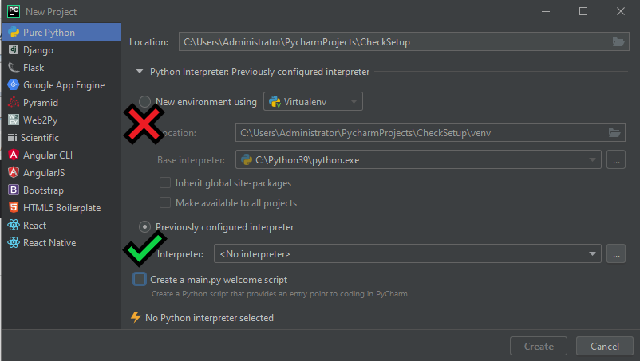
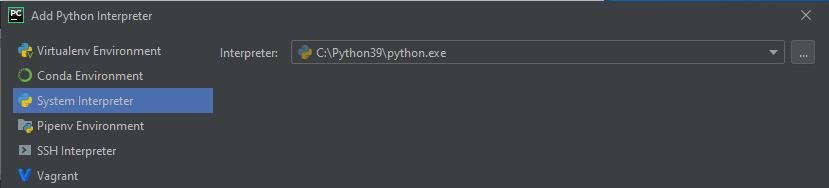
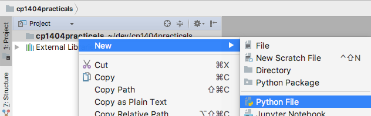
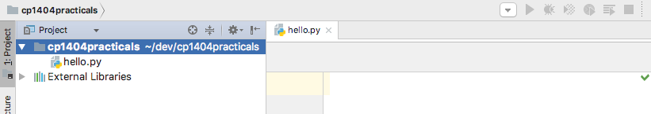
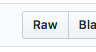
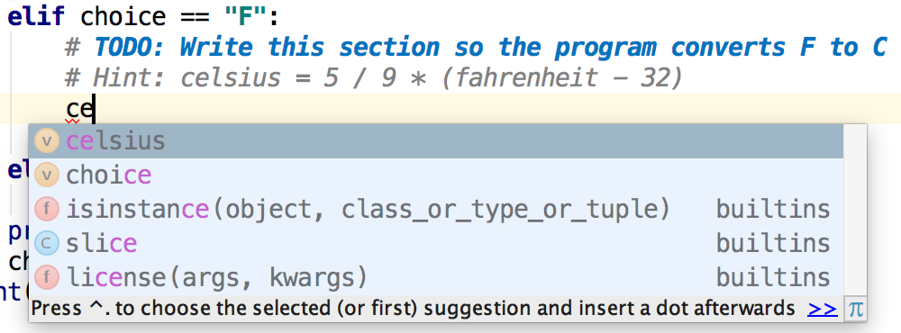
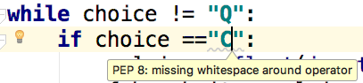
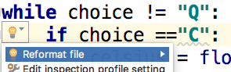

# Practical 01 - Basic Python Programming in PyCharm

**Welcome to CP1404 practicals!**

If you haven't read the introduction to practicals, including marking and submission guidelines,
please [read this now](../README.md).

# Walkthrough Example

Let's start by getting you used to working with the PyCharm IDE
(Integrated Development Environment).

If you are using your own computer, complete the instructions for setting
up all the required software at:
<https://github.com/CP1404/Starter/wiki/Software-Setup>  
To start with, you don't need Git or Kivy, just Python 3 and PyCharm.

> [!NOTE]  
> Your version of PyCharm may look different from our images and instructions below,
> but hopefully they are close enough for you to follow.

1. Run PyCharm.  
   When PyCharm first starts you should have a window with a link to
   create a new project.

    - A PyCharm **project** is a folder on the computer that contains
      Python source code files and related resource files to make your
      program run... but it's more than that. Always do your coding in files that are part of a project - not just
      individual files you open.

    - the **Quick Start** window lists several useful tasks like creating a new project or adjusting the configuration
      of PyCharm

2. Click on **Create New Project**. and choose **Pure Python**. PyCharm
   asks you where to store your new project and to choose an
   interpreter. Name your new project (folder) for your `pracs` (we will make a new project next week when we learn
   version control with Git).

    - the **location** can be changed to any place you have access to. Use a folder that you will be able to find later

    - use the **... button** ("meatball menu") to select the location

    - the **interpreter** is the version of Python we need to run our code on the computer.  
      Use the *previously configured interpreter* for Python 3.  
      **DO NOT use a virtual environment (Virtualenv).** They're cool, but we don't
      need them in this subject... they make things harder for you.

   

    - Click the ... menu button to choose a new interpreter and select the System Interpreter you installed earlier.  
      (This is why it's useful to install Python in a directory you can find.)
      Select the Previously Configured Interpreter you have installed (not a Virtualenv).

   

3. Next, let's add our first source code file to the project.  
   **Right-click** on the project name and select  
   **New > Python File**  
   

4. This opens a window where you can define the name of the file - call
   it `hello.py` and hit the **OK** button. Always give your files
   descriptive names so that they're easy to find again.

5. PyCharm created a new source code file in the project folder and
   opened the editor window:
   
   Have a look at the interface and see what information you can identify (row/column, syntax errors, etc.)

6. Let's learn our first shortcut! Press **Shift+Enter** to add a blank
   line below the one you're on (no matter where the cursor is). Nice!
   Do it again, then add the famous line:

   ```python
   print('Hello world')
   ```

7. To **run** this standard first program, **right-click** in the code
   editor window and select the **run** option.  
   If it didn't work, please check for what the problem might be, then
   if you need to, ask the nearest person for help.

In the next example, we will write a program that can convert between Celsius and Fahrenheit temperatures.

## Project Structure: Use one project for all practicals

**Your project name and structure should look like our template:
<https://github.com/CP1404/cp1404practicals>**  
So you will have **ONE** correctly-named folder for each prac with
well-named files inside those
folders. Names like `prac_01` conform with Python module name conventions, so use underscore_lowercase for file and
folder names.  
If you choose different names from what we have shown, you _will_ have problems later on.

### Seriously!

**DO NOT** create new projects for each separate practical.  
**PLEASE** get this right the first time to save wasted effort fixing it later!

**Do** use separate projects for each assignment and any other side
'projects'.

1. If you don't have your first prac folder (directory) yet, create
   one called `prac_01` and drag your `hello.py` file into it...

2. Right-click on your prac_01 folder and create a
   new Python file here called `temperatures.py`
   Copy the raw version of the code found at the link below and paste
   into your file...  
   Click on the link below, then click the Raw button to get a version
   suitable for copying.  
     
   Don't just copy from the normal view without clicking Raw, or you
   will *not* get proper formatting. OK?

   Download or copy [temperatures.py](temperatures.py)  
   This file is hosted on GitHub in our subject's practicals "repository"
   (or "repo" for short).  
   Bookmark the top level of this repo as we will be
   using it throughout the subject.

3. **Run** this program by right-clicking in the code window and
   choosing **run**. Try converting a couple of Celsius values to
   Fahrenheit.

4. Now see if you can complete the `TODO`. Replace `pass` with your
   code to do the opposite temperature conversion (F to C). Test your code.

## Productivity Tips

Good programmers (that's you!) don't waste time. Here are some
important tips to save you time...

- As you are typing code, notice that PyCharm is trying to
  help you with suggestions and highlights.

- As you type in the name of an existing identifier, PyCharm will show you a list of matching names that
  you can select from by simply pressing ENTER  
  *Don't use your mouse to click on these. Shortcuts aren't shortcuts
  if you use them the long way!*

- The more you type in, the more specific the list becomes  
  

- Notice also that PyCharm colours different parts of the code to help
  you understand what they are - variables in black, functions in
  blue, etc.

- You may also notice that the `# TODO` comment is special. PyCharm
  knows you want to come back to this. You can list all of your TODOs
  in a project, and it can warn you of unfinished or new TODOs when
  you commit your work to version control.

- If you see an underline, move your mouse over it to see what the
  issue is, and look at the action item light bulb icon to see if
  PyCharm can automatically fix it for you. Example:  
  
  

- Please make use of PyCharm's useful support features so that you can work better and faster. It's not cheating; it's
  good practice!

While we're thinking about being more productive...  
A good way to organise your workspace is to put these instructions on
one side of your screen, and your code (PyCharm) on the other side.
Windows users can use the Windows key + arrow shortcuts for this.  
Now you don't have to waste time switching back and forth between these two screens!  
Drag the bar between your project files and your code so that you
can see lots of code (or hide the project window altogether with Alt+1).


Got your windows organised? Let's keep going...

# Intermediate Exercises

Okay, let's practise using PyCharm to write simple programs.

## 1. Sales Bonus

File: `sales_bonus.py`

Create a new Python file in the `prac_01` directory called
`sales_bonus.py`, and copy the following **docstring** at the top
of the file. A docstring is a triple-quoted special comment
"doc(umentation) string".

```python
"""
Program to calculate and display a user's bonus based on sales.  
If sales are under $1,000, the user gets a 10% bonus.  
If sales are $1,000 or over, the bonus is 15%.  
"""
```

Now write the Python code to complete the program according to that
docstring.  
The first line might look like:

```python
sales = float(input("Enter sales: $"))
```

Run and **test** the code with a few different values to verify that
it works.  
Whenever you are testing code, don't just use random values
but values that you know the expected output for and that test all
paths of execution, including the **boundary or edge cases**.  
So, for this program we could use the following (we're only
interested in the values, not the format):

| Test Input       | Expected Output |
|------------------|-----------------|
| 500              | 50              |
| 2000             | 300             |
| 1000 (edge case) | 150             |

Now (only when the above part is finished), add a loop to this,
so it repeatedly asks for the user's sales and prints the bonus
**until** they enter a negative number.  
Be careful with the boundary.  
Remember that **until** is the opposite of **while**, and if you need help,
please [check the patterns](https://github.com/CP1404/Starter/wiki/Programming-Patterns#while-loops-indefinite-iteration).  
Here's some pseudocode to help you:

    get sales
    while sales >= 0
        calculate bonus (this line is intentionally incomplete pseudocode)
        print bonus
        get sales
    do next thing

## 2. Debugging:

File: `broken_score.py`

Someone was trying to write a program
to tell the user if their score is invalid, bad, passable or
excellent, but their code doesn't work.

**Rewrite** the following program using the most
efficient `if, elif, else` structure you can. The code is available
here at: [broken_score.py](broken_score.py)  
Remember to click **Raw** before copying and pasting so that you get proper formatting!  
The _intention_ is that the score must be between 0 and 100 inclusive;
90 or more is excellent; 50 or more is a pass; below 50 is bad.  
Be very careful of your boundary conditions... and **test systematically**.

## 3. Loops

File: `loops.py`

Create a file called `loops.py` and add the following for loop that
displays all the odd numbers between  
1 and 20 with a space between each one.

```python
for i in range(1, 21, 2):
    print(i, end=' ')
print()
```

Now **write more for loops** (using `range`) to do the following:

> [!NOTE]  
> For marking, we expect to see a complete file with each loop still in it.  
> Label each of your questions (a, b, c, d)

a. count in 10s from 0 to 100: `0 10 20 30 40 50 60 70 80 90 100`

b. count down from 20 to 1: `20 19 18 17 16 15 14 13 12 11 10 9 8 7 6 5 4 3 2 1`

c. print n stars. Ask the user for a number, then print that many stars
(`*`), all on one line.

> [!NOTE]  
> This is a very simple loop for repeating n times.  
> We use `for` loops for "definite" iteration like this.  
> `while` loops are used for "indefinite" iteration, like error-checking a user input.

**Sample output:**

    Number of stars: 4
    ****

d. print n lines of increasing stars. Using the same number as above,
print lines of increasing stars, starting at 1 with no blank line.  
E.g., if the user entered `4`, your single loop should print:

    *
    **
    ***
    ****

We've now had the walkthrough and the intermediate exercises where you
mostly have existing code to modify and extend, or you have to write
something really similar to working code you've been given...  
Now we move on to the section where you are given a task/goal to
complete with no starting code. Remember to use the examples above
as a guide, and if you're not sure how to do it, go back to the subject
materials. For example, the question below asks for an error-checking
loop, which is summarised as one of our standard patterns at:
<https://github.com/CP1404/Starter/wiki/Programming-Patterns>

If you need help, ask a classmate or your tutor.

# Do-from-scratch Exercises

## Shop Calculator

File: `shop_calculator.py`

A shop requires a small program that would allow them to quickly work
out the total price for a number of items, each with different prices.

The program allows the user to enter the number of items and the price
of each different item.  
Then the program computes and displays the total price of those items.  
If the total price is over $100, then a 10% discount is applied to that
total before the amount is displayed on the screen.

**Sample output:**  
The output should look something like belof (**bold text** represents user input).  
This uses string formatting to set the currency to 2 decimal places.

<pre>
Number of items: <strong>3</strong>  
Price of item: <strong>100</strong>  
Price of item: <strong>35.56</strong>  
Price of item: <strong>3.24</strong>  
Total price for 3 items is $124.92  
</pre>

Create the file `shop_calculator.py` and write this program.

> [!NOTE]
> Start with the main logic, then adjust your program to improve the formatting if you need to.

### + Error checking (input validation loop)

_After_ you have completed the above program...  
If the number of items is less than zero, the message "Invalid number of items!"
should be displayed and this quantity must be re-entered by the user ***until***
it is valid.

## Menus

File: `menus.py`

One very common programming task is to make menus by combining
looping (repeat the program until the user quits) with selection
(let the user decide what to do).  
The general pattern of a menu-driven program is as follows:

    display menu
    get choice
    while choice != quit option
        if choice == first option
            do first task
        else if choice == <second option>
            do second task
        ...
        else if choice == <n-th option>
            do n-th task
        else
            display invalid input error message
        display menu
        get choice
    do final thing, if needed

> [!WARNING]
> A common error when writing menus is to forget to repeat the menu display and prompt at the end (inside) the loop.  
> Follow the pattern.

Use this pattern to create a very simple menu-driven program according
to the pseudocode below:

    get name
    display menu
    get choice
    while choice != Q
       if choice == H
           display "hello" name
       else if choice == G
           display "goodbye" name
       else
           display invalid message
       display menu
       get choice
    display finished message

Sample output for this program should look like:

<pre>
Enter name: Guido
(H)ello
(G)oodbye
(Q)uit
>>> A
Invalid choice
(H)ello
(G)oodbye
(Q)uit
>>> H
Hello Guido
(H)ello
(G)oodbye
(Q)uit
>>> G
Goodbye Guido
(H)ello
(G)oodbye
(Q)uit
>>> Q
Finished.
</pre>

Before you finish or start the practice and extension work, please check the **Deliverables** section below to ensure
your work is complete.

# Practice & Extension Work

Remember, even though the questions in this final section are not required for marks,
the best way to get better at programming is... ***programming!***  
So do them each and every week :)

You will learn better if you spread your work over multiple sessions
instead of trying to do all of this in one go.  
There are two subsections - *practice*, with easier questions for you to get more... practice  
and *extension*, with harder questions for you to stretch yourself.

Save each program in a different file within the `prac_01` folder.

## Practice

1. **Create an electricity bill estimator**, `electricity_bill.py`  
   Inputs should be:
    - price per kWh in cents,
    - daily use in kWh, and
    - number of days in the billing period.

   **Example use:**

   <pre>
   Electricity bill estimator         
   Enter cents per kWh: <strong>35</strong>          
   Enter daily use in kWh: <strong>4.5</strong>      
   Enter number of billing days: <strong>90</strong> 
   Estimated bill: $141.75            
   </pre>

2. (in the same file) Modify your bill estimator by asking the user to choose which tariff
   they are using - then use the appropriate stored value for cents per
   kWh.  
   Start by defining two **constants** like below.  
   Constants in Python are just variables written in ALL_CAPITALS.

   ```python
   TARIFF_11 = 0.244618
   TARIFF_31 = 0.136928
   ```

   **Example use:**

   <pre>
   Electricity bill estimator 2.0   
   Which tariff? 11 or 31: 11       
   Enter daily use in kWh: 13.4     
   Enter number of billing days: 90 
   Estimated bill: $295.01         
   </pre>

## Extension

### Menu-driven number sequence generator

`sequences.py`

A school teacher requires a small program that would allow primary
school students to learn about various number sequences. The teacher
is interested in a simple menu-driven program that has the following
choices (where x and y are inputs the user enters once at the start
of the program):

    1. Show the even numbers from x to y
    2. Show the odd numbers from x to y
    3. Show the squares of the numbers from x to y (e.g., if x, y = 2, 4 then: 4 9 16)
    4. Exit the program

# Solutions?

Remember that solutions are provided for most prac exercises.  
These exist to help you learn, not just for copying :)  
See the solutions branch here in this repository. Change the **branch** to "solutions" at the top of the page.  
Compare your work to the provided solutions and see if there are any significant differences that you can learn from.

# Deliverables

This section summarises the expectations for marking in this practical.  
Please follow the [submission guidelines](../README.md#submission) to ensure you receive marks for your work.

Files required:

- `temperatures.py`
- `sales_bonus.py`
- `broken_score.py`
- `loops.py`
- `shop_calculator.py`
- `menus.py`
