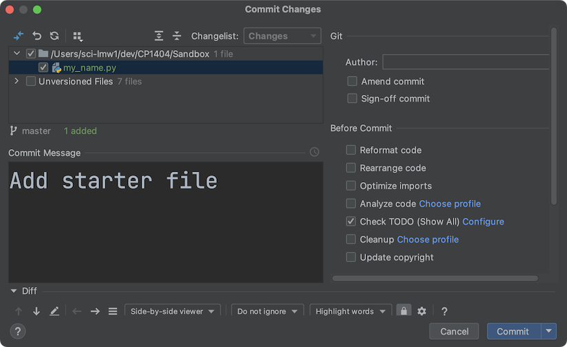
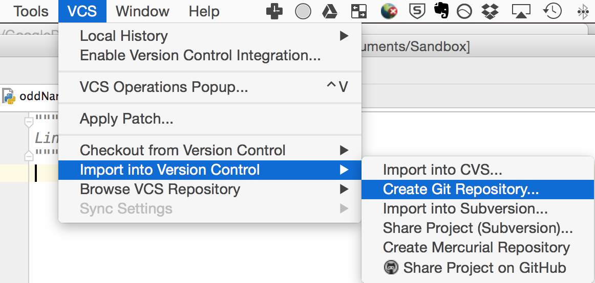
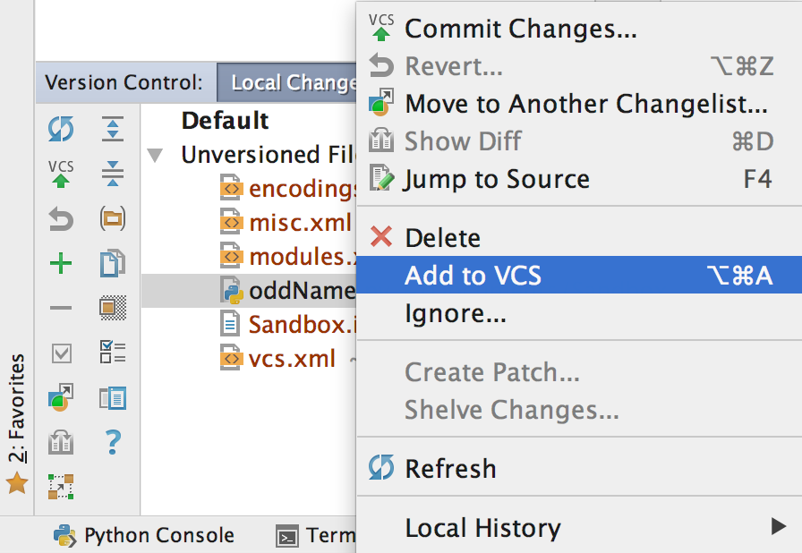
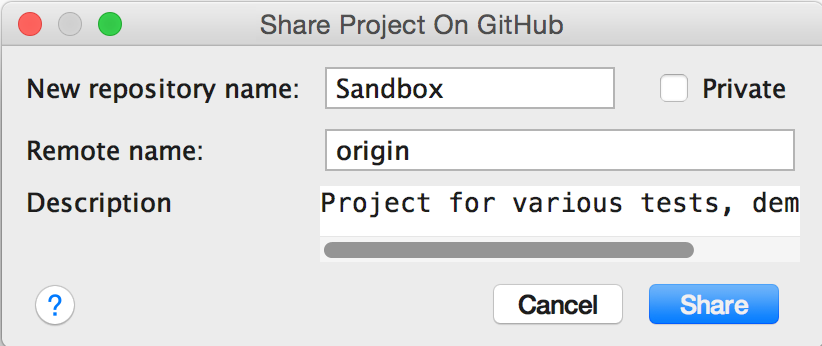
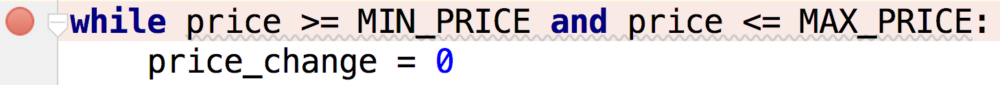
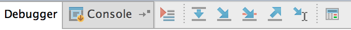

# Practical 03 - Functions, GitHub

This week (and from now on), we'll be using Git and GitHub for our work.

If you haven't setup your own GitHub account, please do so now. See our
instructions at:
<https://github.com/CP1404/Starter/wiki/Software-Setup#github>

Note that you should use a meaningful username that identifies who you
are. JCU staff should be able to determine who you are from your
username. Your GitHub account is an important and professional record of
your work. You will likely use it as an online portfolio in the future.

As you should have noticed, we have a GitHub organisation for this
subject at:
<https://github.com/CP1404>,
which contains repositories for in-class demos, practicals, Kivy
examples...

# First!

  

In one of our end-of-subject YourJCU
student feedback surveys, a student suggested that we do more
hand-writing code to help prepare for the final examination. Great idea! And it
shows it's a great idea for you to provide us with your feedback --
during the semester anytime, and especially in our main surveys.

**On paper**, write a program that asks the user for a password, with
error-checking to repeat if the password doesn't meet a minimum length set by a variable.  
The program should then print asterisks as long as the password.  
Example: if the user enters "Pythonista" (10 characters), the program should print "**********".

It's a valuable skill to be able to write code with pen and paper --
without the support of an IDE. Watch out for things like consistent
variable names and clear indenting as well as basic syntax like colons
and brackets.

# Walkthrough Example

  

We will start by demonstrating the basic
methods for using **Git** version control with **GitHub** as your online
storage tool. Note that ***Git and GitHub are different things!***  
We will do this from the point of view of someone working on a JCU lab computer.
This will be enough to get you started, but please keep learning and
practising with Git and GitHub.

**Note**: It's not easy to provide exact instructions that cover multiple versions 
of PyCharm, since things change. Your experience may be a bit different depending
on what version of PyCharm you have.

1.  Let's start a **new project** (not just a new folder) in PyCharm,
    called **Sandbox**, which you can use for doing small tests and
    demos that you want to keep but don't fit into any other projects.
    Do not put it inside your practicals project or any other project.

2.  Add a Python file called **password_entry.py** and enter just a single
    docstring (triple-quoted comment) at the top with your name in it.

3.  Now we'll put this project into Git version control (without using
    GitHub yet).  
    From the PyCharm menu choose **VCS > Import into Version Control >
    Create Git Repository...**  
        
    Accept the default directory it offers in the next window, which
    should (must) be the current project directory.  
    What happened? Not much it seems, but we're ready to **commit**
    our files to Git version control.

4.  Choose **VCS > Commit Changes** (take note of the shortcut as
    you'll be using it often!)  
    It should tell you no changes were detected...  
    (or some versions will automatically add files for you - don't commit yet)  
    **Note:** If you ever get a prompt to "Add File to Git" for
    PyCharm project metadata files (anything in the `.idea` folder, like
    `misc.xml` or `vcs.xml`), then choose **no**. 
    We do not want to version control these files.  
    Click on the Version Control tool window in the footer (or choose
    **View > Tool Windows > Version Control**) and click the **Log**
    tab. It's empty...  
    This is what happens with a project that has no files marked for
    staging.

5.  Switch to the **Local Changes** tab and you'll see some PyCharm
    files that we don't care about and our one code file, password_entry.py.
    Right-click on this file and choose to **Add** it to Git.    
      
    (We could have done this in other ways, mostly by right-clicking on
    it in the main Project window.)  
    You should now see it listed under **Default** instead of
    **Unversioned Files**, and it changes **colour**!

6.  Click back on the **Log** tab and... it still shows nothing!  
    That's because we've only added this file to the "staging"
    state, so it will be included when we commit.  
    This is important. Git only tracks the files we ask it to.  

7.  Now for our first **commit**!  
    Press the shortcut key for committing changes (Ctrl+K or Cmd+K
    usually) and enter a **meaningful commit message** that briefly
    describes what your change was.  
    **Use the imperative mood** for your messages. (This is the same for
    Python docstrings, by the way.)  
    So don't write like "*Added error checking*" (that's the
    indicative mood), but rather "*Add error checking*".  
    One way to think about this is that your message goes after "If
    applied, this commit will...".  
    For this nearly-empty change you might just use "Initialise
    repository" or "Add starter file".  
    Then click **Commit**.
    You should now see your first commit appear in the Log tab of the
    Version Control tool window. ***Yay!***

8.  Now type the code you wrote on paper earlier for error-checking and printing a
    password as asterisks into your Python file. Test it.

9.  Do another commit with another useful commit message (perhaps
    something like "Add password check program"). Have a look and see that it also
    appears in your log.  
      
    We've now saved the state of our project (just one file) at
    multiple stages by committing to a ***local* Git repository**. We
    have not used GitHub at all yet.  
    We could do this as many times as
    we want, and we could open previous versions of our files through
    the Version Control tool window in PyCharm.

10. Now time for **GitHub**!  
    Choose **VCS > Import into Version Control > Share Project on GitHub**
    Enter your GitHub username and password and press Enter  
    Do not enter a master password, just **Cancel** this. You never *need*
    to use this master password facility in PyCharm.  
    Enter a brief description of the repo and **Share** it.  
    

11. If that worked, then PyCharm will show you a message in the status
    bar (very bottom of the window). You can double-click on this to
    open the event log, then click the Sandbox link to view it in your
    browser on GitHub. (It should be at a URL similar to:
    <https://github.com/yourusername/Sandbox>)  
    You should see that there are 2 commits, and you can click to view
    these online (including seeing file change history).  
    So now GitHub stores our same Git project from our local computer,
    including its history.

12. The GitHub website for your new repo will probably have a suggestion
    for you about adding a readme:  
      
    So let's do it. Click the big green button and enter brief details
    about your project (you can always change them later), then click
    the big green **Commit new file** button (which will accept the
    defaults).  
    Your repo looks much better online now. READMEs are an important
    part of software development!

13. But... we did that online in our GitHub repo. There's a new file
    there, but not locally on our computer.  
    So, let's **pull** those changes.  
    In PyCharm, choose **VCS > Git > Pull**, then click Pull (accept defaults).  
    You should now see the README file in your PyCharm project, and if
    you look, you'll see a 3rd commit with a message like "Create
    README.md" in your commit log.

14. OK, now let's go crazy!  
    Close the project in PyCharm, then delete
    the whole project from your computer. That's right, delete it all!
    This is what you could do if you had finished working on a lab
    computer and you had committed and pushed all of your changes to
    GitHub (that is, make sure GitHub has an up-to-date copy of your
    project).

15. Now, imagine we've moved to another computer on a different day...
    How do we keep working on our project? We **clone** it. Choose
    **VCS > Checkout from Version Control > GitHub** from the menu.  
    (Note: do not use the clone/download button on the GitHub website,
    but use PyCharm or git locally.)  
    Enter the GitHub URL of your Sandbox project, and choose a suitable
    place on your local computer (where your projects are stored), 
    then click **Clone**. You now have the
    whole project, including any previous version history, locally.

16. Now add another file, **list_files.py** and enter this code:

    ```python
    import os  
      
    print("The files and folders in {} are:".format(os.getcwd()))  
    items = os.listdir('.')  
    for item in items:  
        print(item)
    ```
    

17. Run it to make sure it works. It should show you a list of all the
    files and folders in the current (project) folder, and you should
    see one called ".git". This is where Git stores all of the history
    and state information. Don't delete this! If you ever want to move
    a project that's using Git, you can either use GitHub (and
    then clone it to the new place) or you can just copy it, making sure
    you include this folder.

18. Now **Add** this new Python file to VCS so Git tracks it, then
    **Commit and Push** (you should see the option to do both at
    once)... enter a meaningful message... then check that the new file is up
    on GitHub.

So... we covered a fair bit in that walkthrough. Hopefully you can see
the process for working on your projects:

-   **Import** any new projects into Git at the beginning

-   **Add** new files when you make them

-   **Commit** every time you make significant (small milestone)
    changes, using good messages in the imperative voice

-   **Push** to GitHub so you have an up-to-date online copy

Then when you want to keep working on the project again on a different
computer

-   **Clone** the repository from GitHub to your local computer, then
    add, commit, push, etc.

(If you're working on your own computer you won't need to clone --
just keep using the same local repo.)

It is possible to edit and upload files directly via the GitHub website
but **do not do this!**

We only made the Sandbox repo so we could practise Git and GitHub. You
don't need to use it again, but you're welcome to put whatever you
want there... but do not put your practical work in Sandbox.

Now let's get your practicals on GitHub:

Before you follow the same process as above, please make sure your
single practicals project has the same folder structure as
<https://github.com/CP1404/cp1404practicals> and does NOT contain .idea
folders in any of your prac_nn folders. If it doesn't match this --
please tidy up your project or make a new one and copy your Python files
into the correct folders.

Open your project in PyCharm, then **share** it on GitHub.  
**From now on (seriously, for every prac for the rest of the subject)**,
when you finish a task, do a commit with a meaningful message.  
Push your prac work to GitHub at least at the end of each prac. Nice!

You do not need to commit or push for every little change, just for
decent-sized changes and especially for milestones or before you start
making major changes.

Each repo should be a single PyCharm project. Do not have one
project/repo with other projects/repos inside. For pracs, that's one
PyCharm project = one GitHub repo, as we've (hopefully) just set up.

# Intermediate Exercises

## Debugging:

Open your **Capitalist Conrad** program from last week's practical.

Let's step through the program using the interactive debugger now...

1.  Add a **breakpoint** on the while line by clicking in the left
    margin:    
    

2.  Click the "debug" button or choose Run > Debug from the menu or
    press Shift+F9  
    The program will run until it hits the breakpoint - then stop and
    show you the current state of the program and its variables (both
    in the bottom window and in your code)

3.  Try all of the different methods for stepping through the program
    using the toolbar:    
    

## Functions:

Remember that function names should say what they do (use verb phrases).

Note also that functions should **do one thing** - so they might
calculate a value but NOT print it. If they calculated it AND printed
it, that would be two things and you could no longer use that function
if you wanted to use the value without printing it, e.g. in an
expression.

E.g. a function that calculates the area of a rectangle should have the
height and width values passed in as parameters, rather than asking the
user for them in the function. That way it can be used no matter where
these values come from.  
It should also **return** the result rather than printing it. 
That way it can be used no matter what the purpose of the result is. 

**From now on**, when writing programs with functions, create a `main()`
function for the main part of the program. Put the main function at the
*top* and call it at the *bottom*. If you are changing an existing program
that does not already use functions, first put it all in a main function; 
then add the other functions.  
  
So the basic form for all programs now is:

```python
def main():  
    # statements...  
    do_stuff()  
  
def do_stuff():  
    # statements...  
  
main()
```


### Password Check with Functions

At the start you wrote some code for a program that asks the user for
a password and prints asterisks based on its length. Copy this into
your `prac_03` folder and commit (with a message like "Add password check
program"). Now let's modify this program.

1.  Move all of the code inside a main() function and call main() at the
    bottom.  
    **Note:** if you don't have a main function, the refactoring below will
    use global variables. So, it's an important first step to use main before 
    adding other functions.

2.  **Refactor** the part that gets the password into a separate function...  
    You can either do this manually, or by using PyCharm's refactoring tool.  
    If you want to use the tool, select the lines that
    get and check the name (it should be 3-4 lines) then right-click 
    (or use the main menu) and choose **Refactor > Extract > Method...**  
    Change the name to `get_password` and press OK.  
    PyCharm should create the function and replace the old code with a
    call to it like `password = get_password()`  
    (Note that the details depend on how you wrote the code to start with.)

3.  Now refactor the loop that prints the asterisks into a function that
    takes 1 parameter: the password. (PyCharm will see that password needs 
    to be an input parameter and create the function accordingly.)  
    Note that this will be a super simple function, but that's OK.
    
4. Finished? Then commit - with a meaningful message in the imperative voice.  
   This could be something like "Refactor password program to use functions" 

If you have not done so already, please upgrade your account to a free
student account at:
<https://education.github.com/discount_requests/new>  
You will need to upload a photo of your JCU student ID. This allows
you to have private repositories for free, and you can get the GitHub
Education Pack!

# Do-from-scratch Exercises

If you need help with any of these, first ask a classmate - to get used
to helping each other - then talk to your tutor.

1.  Refactor two previous programs to use functions (with suitable
    verb-phrase function names) ...  
    Copy both of these from prac 1 into prac 3, commit, then update
    them. We do the commit first so we can see clearly what we have
    changed. We copy (instead of move) them because we want each week's prac folder to
    contain that week's prac work.  
    Remember, any time we're using functions, we also need a main()
    function for the main program.

    a.  **temperatures.py** - use 2 functions for converting Celsius to
        Fahrenheit and vice versa  
        **Important:** Remember SRP - functions should do one thing, so
        these should be calculation functions. Do not get user input or
        print output in the functions - do those outside.  
        That means these will be very small functions... that's OK...
        they abstract a core piece of functionality.

    b.  **broken_score.py** - use a function that takes in the score
        as a parameter and returns the result to be printed. The
        *function* should not print it; the *main* program should store
        and print the returned value.

# Practice & Extension Work

1.  Copy your **word generator** program from last week into this
    prac's folder. Commit.  
    Add error-checking so that you repeatedly validate the user's input
    until it is a valid sequence of just c's and v's. Create and use a
    function `is_valid_format(...)` to return True or False for if
    the word format is valid or not.  
    **Tip:** use a for loop to iterate through each character in the
    format sequence and return false if you see one that is not valid.

2.  Copy your **ascii_table.py** file from last week's prac into this
    week's folder.  
    Create a function called `get_number(lower, upper)` to get a
    number, making sure that user input is numeric and within the given
    range.  
    You can use exceptions to check the string is a valid number.  
    Repeatedly re-prompt for a number until a valid one is entered, then
    return it.  
    Example:

        Enter a number (10-50):  
        >>>abc  
        Please enter a valid number!  
        Enter a number (10-50):  
        >>>75  
        Please enter a valid number!  
        Enter a number (10-50):  
        >>>30
        (then the function should return 30)

    When this function works, use it in your program in place of the code
    you used to get the number.  
    Test it with both invalid and valid inputs.

3.  **GPS (Gopher Population Simulator)**  
    A secret population of 1000 gophers lives near the library. Every
    year, a random number of gophers is born, between 10% of the current
    population, and 20%. (e.g. 15% of the gophers might give birth,
    increasing the population by 150). Also each year, a random number
    of gophers die, between 5% and 25% (e.g. 8% of the gophers might
    die, reducing the population by 80).

    Write a program that simulates a population of gophers over a
    ten-year period and displays each year's population size.
    The output should look something like this (it's random, so yours
    won't be the same):

        Welcome to the Gopher Population Simulator!
        Starting population: 1000
        Year 1
        
        145 gophers were born. 228 died.
        Population: 917
        Year 2
        
        124 gophers were born. 152 died.
        Population: 889
        Year 3
        
        138 gophers were born. 180 died.
        Population: 847
        ...

## Learn Git and GitHub

The following guide shows you lots of useful things just using GitHub online:
<https://guides.github.com/activities/hello-world/>


### Git Command Line

Even if you just use the built-in tools in your IDE, you will be able to
understand more of what's happening in Git Version Control if you know
the command line tools. Over time you should get experience using both.

So let's learn more about how Git works and pick up some command line
skills by doing the excellent interactive online Git tutorial:

[try.github.io](https://try.github.io)

You may also like to [login to lynda.com](https://cas.secure.jcu.edu.au/cas/login?service=https://www.lynda.com/portal/jcu)
and do one or more of the online courses on GitHub
