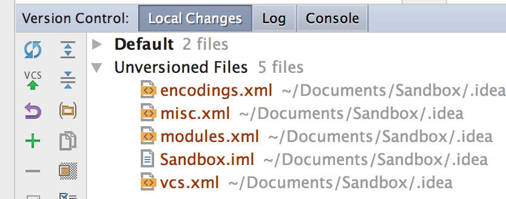
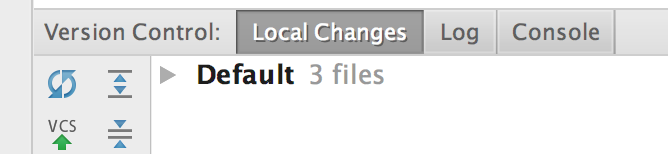

# Practical 04 - Lists

Now that you know how to use Git and GitHub, please use them
consistently for all your work. This should just be how you normally work now.  

If you do not already have your prac work with you, start by **cloning** 
your prac repository via PyCharm, **VCS > Checkout From Version Control > Git/GitHub**  

Each time you finish a task, **commit** it.  

You only need to **push** once - when you finish and/or it's time 
to leave, but you can do it more often if you wish. 

When you're about to make a change, like refactoring, commit first so you
can track the differences and you can go back to a previous version if
you need to.

**Please remember**, if you do not finish a practical during class time,
it's not over... you need to complete it during the week so that you're
all finished by the *start* of the next practical. If you need help with 
anything, bring those questions to your tutor the following
week or ask us for help online.  
And remember, everything you need to know has been taught in the lectures and pracs.

## Warm-Up

Create a Python file called **lists_warmup.py** and enter the following line:

`numbers = [3, 1, 4, 1, 5, 9, 2]`

**What values do the following expressions have?**  
Without running the code, write down your answers to these questions 
(on paper, or in your Python file as a comment), 
then use Python to see if you were correct.  

    numbers[0]
    numbers[-1]
    numbers[3]
    numbers[:-1]
    numbers[3:4]
    5 in numbers
    7 in numbers
    "3" in numbers
    numbers + [6, 5, 3]

Write Python expressions (in your Python file) to achieve the following:

1. Change the first element of numbers to "ten"
2. Change the last element of numbers to 1
3. Get all the elements from numbers except the first two
4. Check if 9 is an element of numbers

## Walkthrough Example

### Calculating a List of Cumulative Totals

*(Read the whole question before starting the work!)*

Accountant Annie wants you to write a program to calculate the monthly
cumulative totals for incomes.  
The program should ask for the number of monthly incomes to enter, then
get and store them in a list.

When the incomes have been entered, the program should display a list of
the month's income next to the cumulative income at that point - for
each month. Here's some sample output:

    How many months? 5
    
    Enter income for month 1: 120
    Enter income for month 2: 245.4
    Enter income for month 3: 900
    Enter income for month 4: 1205.56
    Enter income for month 5: 12.35

    Income Report
    -------------    
    Month  1 - Income: $    120.00         Total: $    120.00
    Month  2 - Income: $    245.40         Total: $    365.40
    Month  3 - Income: $    900.00         Total: $   1265.40
    Month  4 - Income: $   1205.56         Total: $   2470.96
    Month  5 - Income: $     12.35         Total: $   2483.31

Have a think about how to do this before reading on...

We need a **list** to store the incomes. How do you add values to a
list?

We need a counter variable (int) to store the month number (remember
that list indexes start at 0 but we want to print from 1).

How many loops will we need? What kind of loops?

We need a cumulative total to update as we loop through the list to
display the incomes.

And lastly we need to format the output nicely, which we can use the
string format() method for.

**Things to do:**

1.  Copy the starter code from [total_income.py](total_income.py) 
    (remember to use *Raw* mode) and commit it to your own prac repo:

2.  Study it to see how this code answers those questions so far.

3.  Change the line that gets the income input so that it uses the
    string `format()` method instead of string concatenation.

4.  We have two variables that sound very similar: **incomes** and
    **months**. They're both plural so they sound like they're both
    lists. incomes is a list of incomes, so we might assume that months
    is a list of months, but it's actually a scalar value that stores
    the number of months - an int not a list.  
    **Refactor the** months **variable to a better name**. DO NOT just
    change it in 3 places or use find and replace... but use
    refactoring in PyCharm by clicking anywhere on the variable and
    pressing Shift+F6 (or use the menu). Then rename it to something 
    more meaningful, that sounds like a number not a list.

5.  Run the program again with some sample data and make sure it's
    still working well.

6.  Now, let's refactor (move) the report printing into its own
    function. Select those 6 lines and turn them into a new function
    with a good name.  
    (We already have a main function so we don't need to make one.)

7.  Test again and make sure it's all good.

# Intermediate Exercises

Here are some small problems to give you more practice working with
lists.  
Feel free to **check the solutions** for these so you can make sure you're on track.

1.  **Basic list operations**  
    Create the file **list_exercises.py**
    Write a program that prompts the user for 5 numbers and then stores
    each of these in a list called **numbers**.  
    The program should then
    output various interesting things, as in the output below.  
    Note that you can use the **functions** min, max, sum and len, and
    you can use the append **method** to add a number to a list.

        Number: 5
        Number: 20
        Number: 1
        Number: 2
        Number: 3
        The first number is 5
        The last number is 3
        The smallest number is 1
        The largest number is 20
        The average of the numbers is 6.2

2.  **Woefully inadequate security checker**  
    (Still in the same file)  
    Copy the following list of usernames into a new Python file:
      
        usernames = ['jimbo', 'giltson98', 'derekf', 'WhatSup', 'NicolEye', 'swei45', 'BaseInterpreterInterface', 'BaseStdIn', 'Command', 'ExecState', 'InteractiveConsole', 'InterpreterInterface', 'StartServer', 'bob'] 

    Ask the user for their username. If the username is in the above
    list of authorised users, print "Access granted", otherwise print
    "Access denied".

3.  **List comprehensions**  
    Download/copy [list_comprehensions.py](list_comprehensions.py)  
    and see how the example list comprehensions work.  
    Write more list comprehensions (not loops) by completing the TODOs in the code.

# Do-from-scratch Exercises

### "Quick Pick" Lottery Ticket Generator

Create the file **quick_picks.py**  
Write a program that asks the user how many "quick picks" they wish to
generate. The program then generates that many lines of output. Each
line consists of 6 random numbers between 1 and 45.  
These values should be stored as CONSTANTS. 

- **Each line (quick pick) should not contain any repeated number.**  

- **Each line of numbers should be displayed in sorted (ascending)
order.**  

**Note:** Python's random module has a `sample()` function, which
returns a selection from a list. This is a nice way to solve this
problem... but it's too easy :) Do not use it for this program.  

Your code should produce output that matches this sample output
(except the numbers are random):

    How many quick picks? 5
     1 12 14 15 30 36
     2  5  8 33 38 41
     2 12 19 22 29 43
    13 21 28 29 42 43
     3  4 10 11 32 44

### .gitignore

  
Before we're done, let's learn one more Git thing, ignoring files.

You will have files in your project that you don't want stored in your
repo (like PyCharm metadata files). You can just choose not to add them
(as we've done until now) but they do show up as "unversioned files".   
We'd prefer this to only show us files we probably should add.

The solution is to add a file called `.gitignore` to your repository.  
Note the exact spelling, including the dot at the start. On Unix-like
systems (including Mac), the dot makes a file/folder _hidden_.

.gitignore is just a plain text file that stores the names of any files or
folders you want Git not to track and not to warn you about.  
Your file will still exist in your _project_, but not in your _repository_.

**Create a file called .gitignore** in the root folder of your pracs project/repo, 
and let PyCharm add it to Git.

Then enter one line (the trailing slash means it will match a directory
but not a file with that name):

    .idea/

.idea is the directory (folder) that PyCharm stores its project metadata
in.

Now look at that Version Control tool window... problem solved!

Commit.

**Note:** if you have already committed your .idea folder to your
repository, PyCharm does not seem to provide a way to stop tracking this. 
You have to use the Git command line (e.g. git bash, or Mac Terminal).  
Ask your tutor if you've never done this before.  
_Change into your project folder_ and run the following command:

    git rm -r --cached .idea

This removes (rm) recursively (-r) the .idea folder, but only from the
index, not the local disk (--cached).

# Practice & Extension Work

We know from many years of teaching programming, that you need to spend
lots of time writing programs, so here's some to write.    
This final part
of practicals will usually be for you to do outside of practical time.  
Use these exercises as normal practice and as ways to learn new things.

1.  Download the scores reading program: [scores.py](scores.py) and its data file: [scores.csv](scores.csv) 
  
    The data file stores the scores for each subject for 10 people.  
    This code reads the lines into lists, saves the first line as a list
    of subject codes and converts the rest of the lines from a list of
    strings into a list of numbers, which it then prints with the
    maximum value for that subject. Nice... Except, it's broken! It
    reads the lists per user not per subject, so the results are
    incorrect.

    a.  Save the CSV file to your project folder and copy the code into a
        new file and run it to see how it currently works.

    b.  Can you fix it so that it prints the list of (10) scores per
        subject with the maximum per subject?

    c.  When you've done that, also print the minimum and average for
        each subject.

    d.  Then print the results in a nicely-formatted table.

2.  Extend the first intermediate exercise so that the user can enter
    any number of numbers until a number less than zero is entered.
    Adjust the prompt so that it prints like "Number 1: " then "Number
    2: "

3.  Write a program that asks the user for an indefinite set of
    strings - until an empty string is entered - then prints all of the
    strings that were entered more than once.  
    E.g. if the user entered: "hello", "world is good", "hello", "john",
    "good world"... the program would print "Strings repeated: hello".  
    If no repeated strings are entered, the program should print "No
    repeated strings entered".

4.  Memberwise Addition...  
    In Python, the + operator concatenates lists, so (example):  
    `[1, 2, 3] + [4, 5, 6] = [1, 2, 3, 4, 5, 6]`.  
    What if we want to add the elements together instead?  
    Write a function, `add_memberwise`, that takes two lists, and
    returns the list that contains the sum of elements that are in the
    same index in the two lists. For example:  
    `add_memberwise([1, 2, 3], [4, 5, 6])` would return `[5, 7, 9]`  and  
    `add_memberwise([1, 2, 3], [1, 2, 3, 4])` would return `[2, 4, 6, 4]`

## Solutions to Selected Exercises

Remember that we have many solutions available in the solutions branch of the
Practicals repository. Change the branch on GitHub to solutions, or visit:  
<https://github.com/CP1404/Practicals/tree/solutions>

Remember also that the solutions are there to help you learn ***after***
you have done your best to complete the tasks on your own and using the
teaching resources we have provided.
