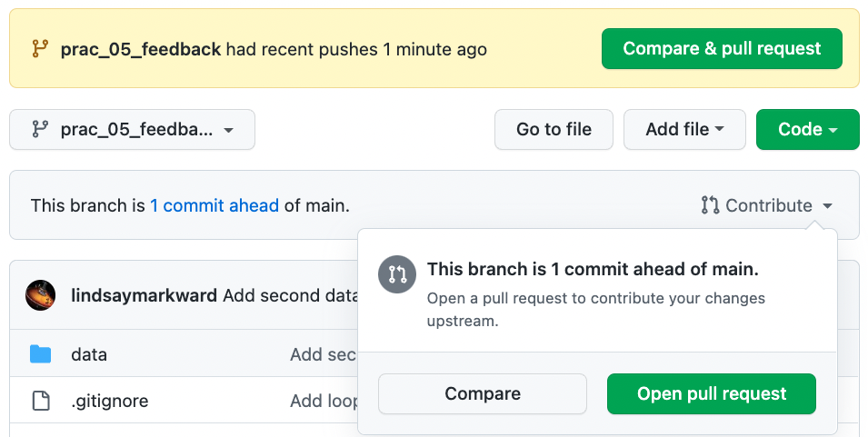

# Practical 05 - Dictionaries, Code Reviews with PRs

_Your_ reason for doing this subject/degree probably has something to do with getting a job in the IT industry.  
_Our_ reason for teaching you things like we are today is the same - to prepare you for work in the industry.

A common and important part of development jobs in the IT industry is doing **code reviews**, where a developer
evaluates and comments on the work of a peer with the goal of improving the final result (and mutual learning).

So, to help you towards being a better programmer and being more familiar with industry practices, today you will work
on some programs, then review another student's work.

*You need to complete the tasks and do a **Pull Request** that *mentions*
another student to get full marks for this practical.*

Your lecturer may have provided you with [details of
whom to mention](https://github.com/CP1404/Starter/wiki/Code-Review-Order), so please follow that.  
Otherwise, follow your lecturer's instructions for whom to mention.

**Remember**: Sometimes there will be changes to the GitHub website or PyCharm that can mean these instructions
will be slightly different from your experience.  
You should still be able to figure out what needs to be done.

First, **edit your notifications settings**:

Go to GitHub, login, then click on your account in the top-right then **Settings**, then **Notifications**.  
Select the "On GitHub" and "Email" options so that you will receive notifications when you're @mentioned.

Code reviews are often done via **pull requests** on GitHub **branches**.

A branch is another version of a repository, stored within that same repository. Branches are useful for things like
working on new features or bug fixes, or in our case getting feedback.

1. Open your PyCharm Practicals project. (If it's not already up to date on GitHub, then commit and push your current
   work now.)

2. Create a branch called `prac_05_feedback` by: **Git > New Branch**

(When you do your work for subsequent pracs, you will use `prac_06_feedback` and so on...)

It may look like nothing happened, but your local repository should now have a new branch, which currently has the same
contents as the 'master' (or 'main') branch, and it is now the one that is "checked out". See this in the PyCharm
footer.

So now the work you do and commit will be in the `prac_05_feedback` branch, not `master`.  
We will then do a pull request
from `prac_05_feedback` to `master`, which is basically a request for someone to **merge** the changes
in `prac_05_feedback`
into the `master` branch... which gives us the opportunity to provide comments via GitHub.

So, you're on the `prac_05_feedback` branch?   
Great! Let's write some code using **dictionaries**...

# Walkthrough Example

Copy the code from: [state_names.py](state_names.py)  
Commit it as-is before you continue.

This is a program that uses a 'constant' (name is ALL_CAPS) dictionary to store the Australian state abbreviations and
names - e.g., QLD is Queensland. It asks the user for their 'short' state and prints the full state name by looking it
up
in the dictionary.

## Modifications

1. Run the program to see how it works.

2. Right now the code formatting is incorrect.  
   Dictionary literals should be formatted with no space before, and one space after, the colon,
   like `{"A": 1, "B": 2}`  
   Thankfully, PyCharm knows this and can fix all your formatting problems for you!
   If you move your mouse over the grey line near the first colon, PyCharm pops up the problem... Click on it to see the
   action icon (light bulb) to the left... Click on that to see the options... Choose reformat file... Problem solved.  
   You can also choose **Code > Reformat Code** or use the keyboard shortcut (`Ctrl+Alt+L`) any time. It does the whole
   file or
   whatever is selected. No more excuses for dodgy formatting! Seriously, always fix your formatting :)   
   This is also a great way to learn what the "PEP 8" standards are for Python code formatting style.  
   

3. Currently, the program requires you to enter the states in capitals ("qld" won't work). Change the program so
   lowercase inputs also work
   to show the state names. (There are two places to add a string method.)

4. Write a loop that prints all the states and names **neatly lined up**
   with string formatting, like:

       NSW is New South Wales
       QLD is Queensland
       NT  is Northern Territory

5. This code uses the "Look Before You Leap" (LBYL) approach to checking `if` the key is in the dictionary. Change this
   to use exceptions and the "Easier to Ask Forgiveness than Permission" (EAFP) approach.

## Are you committed?

Remember to commit each "small milestone" as you work.  
Now, and for each exercise, is a good time to commit.  
Remember to use a good message in the imperative mood.  
A reasonable message for the above work would be something like:  
`Complete prac 5 state names exercise`

# Intermediate Exercises

File: `hex_colours.py`

Based on the state name example program above, create a program that allows you to look up hexadecimal colour codes like
those at
[http://www.color-hex.com/color-names.html](http://www.color-hex.com/color-names.html)

Use a constant dictionary of about 10 colour names and write a program that allows a user to enter a name and get the
code, e.g., entering
`AliceBlue` (or `aliceblue` - make it case-independent) should show `#f0f8ff`.

Entering an invalid colour name should not crash the program.  
Allow the user to enter names until they enter a blank one to stop the loop.

> [!NOTE]
> We have just done two exercises that use dictionaries that are constants and named in ALL_CAPS.  
> Please don't think this is any kind of rule or pattern.  
> Dictionaries that change would not be constants.

# Do-from-scratch Exercises

One very useful skill for programmers, and students, is the ability to **estimate** well.  
**For each of the following exercises**, read the instructions then estimate how long you think the task will take to
complete.  
Record your estimation in the docstring at the top of your solution.  
Set a timer when you start the work.  
Then, when you finish, record how long it actually took in the same place.  
Example:

```python
"""
Word Occurrences
Estimate: 20 minutes
Actual:   32 minutes
"""
```

## Word Occurrences

File: `word_occurrences.py`

Write a program to count the occurrences of words in a string. The program should ask the user for a string, then print
the counts of how many of each word are in the string.  
The output should look like this (depending on user input):

    Text: this is a collection of words of nice words this is a fun thing it is
    a : 2
    collection : 1
    fun : 1
    is : 3
    it : 1
    nice : 1
    of : 2
    thing : 1
    this : 2
    words : 2

**Hints:** use a dictionary where the keys are the words and the values are the counts; when you find a word, check if
it's in the dictionary...

- Notice that the sample output is **sorted**.  
  *Only after* you have the program working, **make your program do this sorting**.

- Now **align the outputs so the numbers are in one nice column**. You will need to find the
  longest word in the list first.  
  Then you can use f-string formatting and a variable
  width. This can be done with another `{}` placeholder, like in this example:

```python
thing, width, other_thing = "first", 13, "second"
print(f"{thing:{width}} = {other_thing}")
```

This formats the first placeholder value, `thing`, with a width of `width` then prints a literal `=` then the value
of `other_thing`.  
Your output should then look something like:

      a          : 2
      collection : 1
      fun        : 1

Now that you've read the instructions, remember to record your time estimate in your docstring.

## Emails

File: `emails.py`

**Remember to include your estimate and actual time in the module docstring.**

Write a program that stores users' emails (unique keys) and names (values) in a dictionary.  
Remember to use our naming convention for dictionaries, `key_to_value`.  

Ask the user for an email until they enter a blank one.  
Use a separate function to extract a name from the email as in the example below.  
You should find the following methods useful: `split`, `join`, `title`.

Notice the prompt to check if the name is correct: `Y/n`  
This is used in console programs (like in Linux etc.) so you can just press Enter to accept the default of (Y)es.  
Example from Linux:

    > sudo apt-get upgrade
    ...
    After this operation, 267 kB of additional disk space will be used.
    Do you want to continue? [Y/n] blah
    Abort.

In our program, if the user does not press Enter or `Y`, then ask for their name.  
Once you have stored all the emails and names, just loop through the dictionary (use the `items` method) and print
them out.

    Email: lindsay.ward@jcu.edu.au
    Is your name Lindsay Ward? (Y/n)
    Email: abe@gmail.com
    Is your name Abe? (Y/n) y
    Email: jimbo546@hotmail.com
    Is your name Jimbo546? (Y/n) no
    Name: Jim Boh
    Email: 
    
    Lindsay Ward (lindsay.ward@jcu.edu.au)
    Abe (Abe@gmail.com)
    Jim Boh (jimbo546@hotmail.com)

## Kivy Demo

Before we do our last big question, let's try something fun to prepare for our Kivy topic coming in a few weeks.  
We hope you're looking forward to writing GUI (Graphical User Interface) programs :)  
One of the reasons we do this quick task now is to ensure you've correctly set up your computer to run and edit Kivy
code.  
If you have not done so yet, install Kivy and the KV language auto-completion and syntax highlighting according
to [our installation instructions](https://github.com/CP1404/Starter/wiki/Software-Setup#kivy)

Save the two files provided to your prac_05 directory:

- [kivy_demo.py](kivy_demo.py)
- [kivy_layout.kv](kivy_layout.kv)

Run the Python file.  
If it does not work, complete the setup instructions above.

Explore the code for between 3 and 7 minutes and see what you can figure out just from reading it.

### Things to do

The kv file is where we declare the layout of the widgets in our GUI programming.  
**Add a new Label** widget at the bottom like this.  
We've included the last couple of lines of the existing file. Don't duplicate this.

    BoxLayout:
        id: names_box
    Label:
        text: "I did this :)"

Run that and see if you get a new widget at the bottom with the text "I did this :)".  
Now, make that label smaller so that it only takes up 10% of the vertical space.  
**Hint**: The existing `status_text` label only takes up 20% of the space.

## Wimbledon

File: `wimbledon.py`

**Remember to include your estimate and actual time in the module docstring.**

Save the [wimbledon.csv](wimbledon.csv) data file provided.  
This is based on
[the Wikipedia entry Wimbledon gentlemen's singles champions](https://en.wikipedia.org/wiki/List_of_Wimbledon_gentlemen%27s_singles_champions)
.

Write a program to read this file, process the data and display processed information: 

- the champions and how many times they have won.
- the countries of the champions in alphabetical order

### Requirements and Hints

You need to store the data in appropriate data structures.  
The solution uses: a list of lists, a dictionary and a set.

The file is not in simple ASCII format but UTF-8 with a byte order mark, or BOM.  
You can account for this by setting the encoding like:

```python
with open(filename, "r", encoding="utf-8-sig") as in_file:
```

For the final output of countries, use the `join` method to create a single string.

Use functions for each logical step/chunk of the program.  
If you write it all in main to start with, that's fine, but then refactor it.  
The solution uses 4 functions including `main`.

### Sample output (truncated)

```
Wimbledon Champions: 
Rod Laver 2
...
Lleyton Hewitt 1
Roger Federer 8
Rafael Nadal 2
Novak Djokovic 7
Andy Murray 2

These 12 countries have won Wimbledon: 
AUS, CRO, ESP, FRG, GBR, GER, NED, SRB, SUI, SWE, TCH, USA

```


# Code Reviews with Pull Requests

First, here are some recent student comments about the value of doing code reviews:

- _After getting some code reviews I have started to think "what would this look like to someone else",
  which motivates me to make cleaner code._
- _While doing code reviews I often realised that I had made a mistake in my own work/could improve it_

Now that you've finished the coding work, it's time to request a code review...  
Our process is based on how code reviews and pull requests (PRs) happen in
the IT industry, but is simplified to suit our teaching environment.

## Request a code review

1. Commit your changes, making sure to add any new files that you created today.  
   You have already created and switched to the `prac_05_feedback` branch so your commits will go only to
   this branch (not master).

2. Open your repository in a web browser, and you should see a notice about recent changes, with a button to create a
   pull request:

   
   What you see may be different, but please follow along adjusting for any differences.

3. Click the green button to make a pull request from prac_05_feedback to master.  
   If that notice doesn't appear, you may need to switch to the prac_05_feedback branch first.  
   Add a title like "Prac 5 code review request" and some detail about what you would like checked. In this description,
   you must **mention** the
   reviewer with their GitHub username and the @ symbol - e.g., \@personname so they will be notified.

   If you are the first to do this, you're finished for now... move on to the next section and come back here when you
   receive a mention to do a review for someone else...  
   When you have someone else's PR to review, carry on with the next steps:

## Provide a code review

> [!NOTE]
> We do not expect you to complete the code review of someone else this week.   
> We expect that you will review another student's prac during next week.
> This week, you will submit your request for prac 5.  
> Next week, you will submit your request for prac 6 and your review of someone's prac 5.

1. On the GitHub website, click on the notifications icon at the top:
   which should have a dot on it if you've received your code review
   request.   
   Open the PR you have been mentioned in by clicking the notification link.  
   Read the request (see if there's anything specific to review), then click on Commits to see the commits.
   Then click on the commit to see the code in "diff" view (old on the left, new on the right).

2. Read through the code on GitHub and add line comments. Hover your mouse over the lines and look for the plus icon to
   add a comment. Choose to **"Add single comment"**. Do not choose "Start a review".   
   

   Your job is to look for anything that could be improved including incorrect, inconsistent or non-ideal naming,
   formatting, logic... anything relevant. Add clear explanations, suggestions or questions.

   > [!IMPORTANT]
   > This is not a trivial exercise. Don't just write "all good mate :)", but take your time and add
   > thoughtful comments that help you and the requester to learn and improve.
   > Make this a valuable experience by doing it well.

   At some point you will receive comments from the review you requested. You can respond to these by making changes
   in your own code in PyCharm and replying to the comments on GitHub.  
   Then commit your work back to GitHub, still in
   the prac_05_feedback branch.

3. Ideally, the reviewer would re-check this new work after the updates and make more comments... then the author does
   more work if need be... reviewer adds more comments... until all good (the reviewer decides when it's finished) ...
   then the reviewer would close the pull request.  
   In our simplified version of this process, you can just **Merge the pull request** now (add a comment if you want).
   This merge replaces what was in the master branch with what is in the prac_05_feedback branch.    
     
   GitHub will tell you that the prac_05_feedback branch can be deleted. You're welcome to delete it (both on GitHub and
   locally).

4. Now the master branch has been updated on GitHub (remote), but not locally.  
   In PyCharm, *switch back to the local master branch* by clicking in the footer where it shows the branch:  
   

5. **Pull** your changes from master (remote) to update your local repo:
   **Git > Pull** then click **Pull**.  
   You should now be on your local master branch and see all your up-to-date work.

All done!

To read more about Pull Requests:
[https://help.github.com/articles/using-pull-requests/](https://help.github.com/articles/using-pull-requests/)

# Practice & Extension Work

## Practice

1. Write a program that uses a dictionary to store and look up your friends' names and addresses. Assume you don't have
   many friends :) and none of them share the same name
   (this means the name can be the unique key for the dictionary). Create a simple menu for your program, which should
   allow you to do the following
   (remember to implement this incrementally, one bit at a time):

    - Enter a new name & address
    - Change an address for an existing entry
    - Print the address for a name you choose

2. In practical 1, you should have created an electricity bill estimator using constant values for the tariff amounts
   like:

   ```python
   TARIFF_11 = 0.244618
   TARIFF_31 = 0.136928
   ```

   Electricity bill estimator 2.0   
   Which tariff? 11 or 31: 11       
   Enter daily use in kWh: 13.4     
   Enter number of billing days: 90
   Estimated bill: $295.01

Now create a version of the above electricity program that uses a
**dictionary** to store the tariffs and the corresponding cost.  
In the prompt, list all the tariffs (all the dictionary keys)
and make sure a valid one is selected.  
Use the appropriate cost from the dictionary to calculate the bill total.

You will need to change how you present the "Which tariff" prompt, since these values come from the dictionary.

To show the benefit of this, add three more tariffs (make them up).  
You should find that this is a very simple step for you, and your program can handle it without any extra coding.

## Extension

### More Tennis

Extend your Wimbledon program to display other useful information, like:

- Sort the players by who has won the most championships
- Which players have _lost_ the most finals
- Countries listed by the number of times they've had a player in the final
- Which were the longest matches by number of games played
- ... anything else you find interesting

Add a menu to your program to ask the user what they want to see displayed.

### Convert parallel lists into a dictionary...

Recall that it's possible to represent information in the form of parallel lists where the indices determine how the
information is related across lists. For example:

```python
names = ["Jack", "Jill", "Harry"]
dates_of_birth = [(12, 4, 1999), (1, 1, 2000), (27, 3, 1982)]  
```

This means Jack was born on 12/4/1999, Jill was born on 1/1/2000, and Harry was born on 27/3/1982.

Write a function that takes two parallel lists as input parameters and returns a dictionary where keys are from the
first list and the values are from the second. Use the above example as a test case.

### Name and Address

Extend your name & address program with file loading and saving
(and any other fun things you'd like to add).

# Deliverables

This section summarises the expectations for marking in this practical.  
Please follow the [submission guidelines](../README.md#submission) to ensure you receive marks for your work.

- Type the URL of your Pull Request (PR) that mentions another student properly.
    - Your PR URL will look something like: `https://github.com/lindsaymarkward/cp1404practicals/pull/1`
- `state_names.py`
- `hex_colours.py`
- `word_occurrences.py`
- `emails.py`
- `wimbledon.py`
- `kivy_layout.kv`
