# Practical 05 - Dictionaries, Code Reviews with PRs

**Did you finish last week's work? Including the practice section?**  
If not, make sure to complete it during the week. The more you practise, the better you'll learn.   
If you have any questions, ask your peers or tutor the following week.

_Your_ reason for doing this subject/degree probably has something to do with getting a job in the IT industry.

_Our_ reason for teaching you things like we are today is the same - to prepare you for work in the industry.

A common and important part of development jobs in the IT industry is doing **code reviews**, where a developer
evaluates and comments on the work of a peer with the goal of improving the final result (and mutual learning).

So, to help you towards being a better programmer and being more familiar with industry practices, today you will work
on some programs, then review another student's work.

*You need to complete the tasks and do a **Pull Request** that *mentions*
another student to get full marks for this practical.*

Your lecturer may have provided you with details of
[whom to mention](https://github.com/CP1404/Starter/wiki/Code-Review-Order), so please follow that.  
Otherwise, follow your lecturer's instructions for whom to mention.

**Remember**: Sometimes there will be changes to the GitHub website design or PyCharm, etc. that mean these instructions
will be slightly different.  
You should still be able to figure out what needs to be done.

First, **edit your notifications settings**:

Go to GitHub, login, then click on your account link (top-right) and choose Settings, then Notifications.  
Click to select the "Web" and "Email" options so that you will receive notifications when you're mentioned.

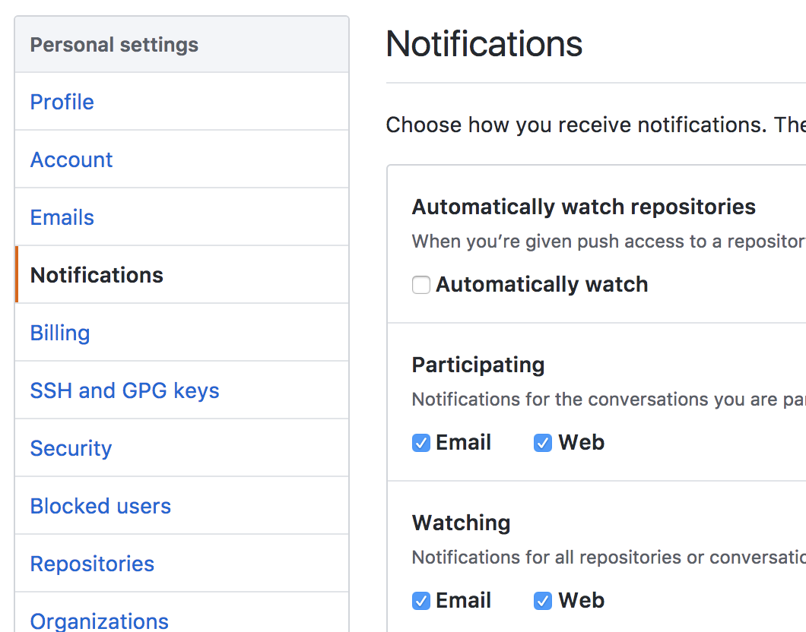

Code reviews are often done via **pull requests** on GitHub
**branches**.

A branch is another copy or version of an entire repository. Branches are useful for things like working on new features
or bug fixes, or in our case getting feedback.

1. Open your PyCharm Practicals project. (If it's not already up to date on GitHub, then commit and push your current
   work now.)

2. Create a branch called "prac_05_feedback" by: **Git > Branches**
   then click **+ New Branch**

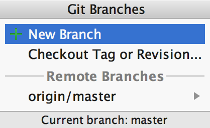

When you do your work for the following prac, if you need/want to do a pull request, use `prac_06_feedback` and so
on...  
(In previous years, we used the same branch name for all PRs
(external students do one every week), but this caused some confusion with students continuing to work on 'old'
branches, so now we ask for a new branch for each prac.)

It may look like nothing happened, but your local repository should now have a new branch, which currently has the same
contents as the 'master' branch, and it is now the one that is "checked out". See in the footer:

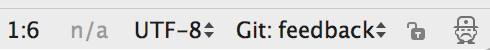

So now the work you do and commit will be in the prac_05_feedback branch, not the master. We will then do a pull request
from prac_05_feedback to master, which is basically a request for someone to **merge** the changes in prac_05_feedback
into the master branch... which gives us the opportunity to provide comments via GitHub.

So, you're on the prac_05_feedback branch?   
Great! Let's write some code using **dictionaries**...

# Walkthrough Example

Copy the code from: [state_names.py](state_names.py)

This is a program that uses a 'constant' (name is ALL_CAPS) dictionary to store the Australian state abbreviations and
names - e.g. QLD is Queensland. It asks the user for their 'short' state and prints the full state name by looking it up
in the dictionary.  
**Note:** not all dictionaries will be constants! This one makes sense, since we won't be changing the states anytime
soon.

## Modifications

1. Run the program to see how it works.

2. Right now the code formatting is incorrect.  
   Dictionary literals should be formatted with no space before, and one space after, the colon,
   like `{"A": 1, "B": 2}`  
   Thankfully, PyCharm knows this and can fix all your formatting problems for you!
   If you move your mouse over the grey line near the first colon, PyCharm pops up the problem... Click on it to see the
   action icon (light bulb) to the left... Click on that to see the options... Choose reformat file... Problem solved.  
   You can also choose **Code > Reformat Code** or use the keyboard shortcut any time. It does the whole file or
   whatever's selected. No more excuses for dodgy formatting! Seriously, always fix your formatting :)   
   This is also a great way to learn what the "PEP 8" standards are for Python code formatting style.  
   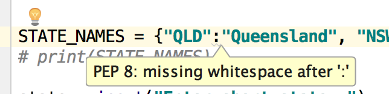

3. Currently the program requires you to enter the states in capitals. Change the program so lowercase inputs also work
   to show the state names. (There are two places to add a string method.)

   
4. Do this next part on paper first (then in PyCharm):  
   Write a loop that prints all of the states and names **neatly lined up**
   with string formatting, like:

       NSW is New South Wales
       QLD is Queensland
       NT  is Northern Territory

# Intermediate Exercises

File: `hex_colours.py`

Based on the state name example program above, create a program that allows you to look up hexadecimal colour codes like
those at
[http://www.color-hex.com/color-names.html](http://www.color-hex.com/color-names.html)

Use a constant dictionary of about 10 colour names and write a program that allows a user to enter a name and get the
code, e.g. entering
**AliceBlue** (or aliceblue - don't worry about matching the case) should show **#f0f8ff**.

Entering an invalid colour name should not crash the program.  
Allow the user to enter names until they enter a blank one to stop the loop.

**Note:** We have just done two exercises that use dictionaries that are constants and named in ALL_CAPS. Please don't
think this is any kind of rule or pattern. Dictionaries that change would not be constants.

# Do-from-scratch Exercises

File: `word_occurrences.py`

Write a program to count the occurrences of words in a string. The program should ask the user for a string, then print
the counts of how many of each word are in the file.  
The output should look like this:

    Text: this is a collection of words of nice words this is a fun thing it is
    a : 2
    collection : 1
    fun : 1
    is : 3
    it : 1
    nice : 1
    of : 2
    thing : 1
    this : 2
    words : 2

**Hints:** use a dictionary where the keys are the words and the values are the counts; when you find a word, check if
it's in the dictionary...

- Notice that the sample output is sorted.  
  *Only after* you have the program working, **make your program do this sorting**.

- As a further refinement, **align the outputs so the numbers are in one nice column**. You will need to find the
  longest word in the list first.  
  Then you can use the string `format` method (or f-strings) to take a variable
  width. This can be done with another `{}` placeholder, like in this example:

  ```python
thing, width, other_thing = "first", 13, "second"
print("{:{}} = {}".format(thing, width, other_thing))
print(f"{thing:{width}} = {other_thing}")  # or f-string version
  ```

  This formats the first placeholder value, `thing`, with a width of `width` then prints a literal = then the value of `other_thing`.  
  Your output should then look something like:

      a          : 2
      collection : 1
      fun        : 1

File: `emails.py`

Write a program that stores users' emails (unique keys) and names (values) in a dictionary.  
Ask the user for their email until they enter a blank one.  
Use a separate function to get the name from the email as in the example below.  
You should find the following methods useful: `split`, `join`, `title`.  
Notice the prompt to check if the name is correct: `Y/n`  
This is used in console programs (like in Linux etc.) so you can just press Enter to accept the default, which is Yes.
If it's not correct, ask the user for their name.  
Once you have stored all of the emails and names, just loop through the dictionary (use the `items` method) and print
them out.

    Email: lindsay.ward@jcu.edu.au
    Is your name Lindsay Ward? (Y/n)
    Email: abe@gmail.com
    Is your name Abe? (Y/n) y
    Email: jimbo546@hotmail.com
    Is your name Jimbo546? (Y/n) no
    Name: Jim Boh
    Email: 
    
    Lindsay Ward (lindsay.ward@jcu.edu.au)
    Abe (Abe@gmail.com)
    Jim Boh (jimbo546@hotmail.com)


# Code Reviews with Pull Requests

Now that you've finished the main code, it's time to request a code review...

The following (and creating the branch earlier) is a process based on how code reviews and pull requests (PRs) happen in
the IT industry but simplified to suit our teaching environment.

1. Commit your changes, making sure to add any new files that you created today.  
   You have already created and switched to the 'prac_05_feedback' branch so your commits will go only to the
   prac_05_feedback branch (not master).

2. Open the repository in a web browser and you should see a notice like:

   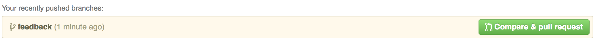
   Note: it's possible that your experience will be slightly different, so please try and understand what's happening -
   don't just click things.

3. Click the green button to make a pull request from prac_05_feedback to master.  
   If that notice doesn't appear, you can switch to the prac_05_feedback branch and click the button to create a new
   Pull Request:  
   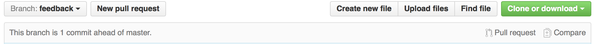  
   Add a title like "Prac 5 code review request" and some detail like
   "Please check formatting, naming and logic" (or anything else you want checked). In this description, *mention* the
   reviewer with their GitHub username and the @ symbol - e.g. \@personname - so they will be notified (depending on
   their GitHub preferences).

   If you are the first to do this, you're finished for now... move on to the next section and come back here when you
   receive a mention to do a review for someone else...  
   If you've already got a PR to review, then carry on with the next steps:

4. (Note that you might see things a bit different, but the process is the same.)  
   On the GitHub website, click on the notifications icon at the top:
   which should have a dot on it if you've received your code review
   request.   
   Open the PR you have been mentioned in by clicking the notification link there, e.g.:
   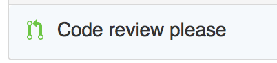  
   Read the request (see if there's anything specific to review), then click on Commits to see the commits:  
   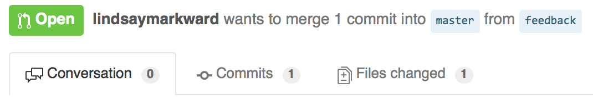  
   Then click on the commit to see the code in "diff" view (old on the left, new on the right).

5. Read through the code on GitHub and add line comments. Hover your mouse over the lines and look for the plus icon to
   add a comment.  
   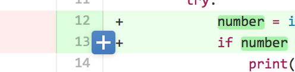

   Your job is to look for anything that could be improved including incorrect, inconsistent or non-ideal naming,
   formatting, logic... anything relevant. Add clear explanations, suggestions or questions.  
   **Important:** this is not a trivial exercise. Don't just write "all good mate :)", but take your time and add
   thoughtful comments that help you and the requester to learn and improve.

   At some point you will receive comments from the review you requested and you can respond to them by making changes
   in your own code in PyCharm and replying to the comments on GitHub. Then commit your work back to GitHub, still in
   the prac_05_feedback branch.

6. Ideally, the reviewer would re-check this new work after the updates and make more comments... then the author does
   more work if need be... reviewer adds more comments... until all good (the reviewer decides when it's finished) ...
   then the reviewer would close the pull request.  
   In our simplified version of this process, you can just **Merge the pull request** now (add a comment if you want).
   This merge replaces what was in the master branch with what is in the prac_05_feedback branch.    
   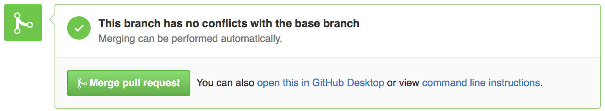  
   GitHub will tell you that the prac_05_feedback branch can be deleted. You're welcome to delete it (both on GitHub and
   locally).

7. Now the master branch has been updated on GitHub (remote), but not locally.  
   In PyCharm, *switch back to the local master branch* by clicking in the footer where it shows the branch:  
   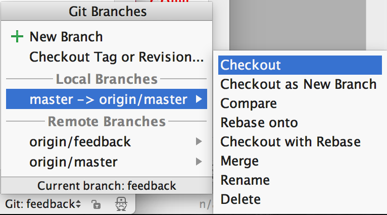

8. **Pull** your changes from master (remote) to update your local repo:
   **Git > Pull** then click **Pull**.  
   You should now be on your local master branch and see all your up-to-date work.

All done!  
*What did you learn from this?*

To read more about Pull Requests:
[https://help.github.com/articles/using-pull-requests/](https://help.github.com/articles/using-pull-requests/)

Not all done :)  
Now on to more practice programming...

# Practice & Extension Work

## Practice

1. Write a program that uses a dictionary to store and look up your friends' names and addresses. Assume you don't have
   many friends :) and none of them share the same name
   (this means the name can be the unique key for the dictionary). Create a simple menu for your program, which should
   allow you to do the following
   (remember to implement this incrementally, one bit at a time):

    - Enter a new name & address
    - Change an address for an existing entry
    - Print the address for a name you choose

2. In practical 1, you should have created an electricity bill estimator using constant values for the tariff amounts
   like:

   ```python
   TARIFF_11 = 0.244618
   TARIFF_31 = 0.136928
   ```

   <pre>
   Electricity bill estimator 2.0   
   Which tariff? 11 or 31: 11       
   Enter daily use in kWh: 13.4     
   Enter number of billing days: 90 
   Estimated bill: $295.01         
   </pre>

   Now create a version of the above electricity program that uses a
   **dictionary** to store the tariffs and the corresponding cost.  
   In the prompt, list all of the tariffs (all of the dictionary keys)
   and make sure a valid one is selected.  
   Use the appropriate cost from the dictionary to calculate the bill total.

   You will need to change how you present the "Which tariff" prompt, since these values come from the dictionary.

   To show the benefit of this, add three more tariffs (make them up).  
   You should find that this is a very simple step for you, and your program can handle it without any extra coding.

## Extension

1. Convert parallel lists into a dictionary...

   Recall that it's possible to represent information in the form of parallel lists where the indices determine how the
   information is related across lists. For example:

   ```python
   names = ["Jack", "Jill", "Harry"]
   dates_of_birth = [(12, 4, 1999), (1, 1, 2000), (27, 3, 1982)]  
   ```

   This means Jack was born on 12/4/1999, Jill was born on 1/1/2000, and Harry was born on 27/3/1982.  
   Write a program using a dictionary instead of the above parallel lists that allows the user to enter the
   date-of-birth details for 5 people, and have it display their individual ages.  
   **Hint:** you can **split()** a string like "12/4/1999", as we did in the lecture last week.

2. Write a function that takes two parallel lists as input parameters and returns a dictionary where keys are from the
   first list and the values are from the second. Use the above example as a test case.

3. Extend your name & address program with file loading and saving
   (and any other fun things you'd like to add).

# Deliverables

This section summarises the expectations for marking in this practical.

- Practicals repository on GitHub and up-to-date (every week)
- Pull Request that mentions another student properly
- `state_names.py`
- `hex_colours.py`
- `word_occurrences.py`
- `emails.py`
