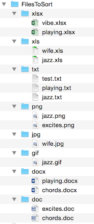

# Practical 09 - OS

Don't forget to make a new branch, `prac_09_feedback` _before_ you start!

Today we will explore Python as an automation tool to help us automate repetitive tasks with files and the **os**
module.

# Walkthrough Example

Download all the files from this prac folder.

- Extract the **Lyrics.zip** file so that it's in a subdirectory called `Lyrics` inside this prac folder.

- Open the directory Lyrics/Christmas so that you can see the files listed in your file browser or PyCharm  
  (but note that PyCharm doesn't always refresh as often as you might like).

- Open the [os_demos.py](os_demos.py) file, read the code and comments to see what it's demoing, then run it.  
  Notice that it imports the `os` and `shutil` modules for working with the operating system and files.

## Modifications:

(Follow the TODO comments in the code.)

1. Run the program again, and you should get a crash due to trying to create an existing directory.  
   Use exception handling to avoid this crash. Remember that you can read the crash message to see what exception you
   need to handle.

2. There are two commented-out options. Try each, one at a time:  
   **Note:** renaming or moving files changes their names (amazing!), so to re-run your code with the files in their
   original state, you can just re-copy them from the Lyrics.zip file provided.

   a.  **rename** files (in same directory) using `os.rename()`

   b.  **move** files to a subdirectory with the new name using
   `shutil.move()`

3. Restore your original files (extract the zip file again).  
   The last part of this file demonstrates the `os.walk()` function that "walks"
   through all subdirectories returning useful information about the contents...  
   Comment out the call to `main()` and uncomment `demo_walk()`.  
   Run the code to see how walk works.

4. Add a loop that renames all the files in `filenames`.  
   This should rename every file in every subdirectory... but
   (depending on how you did this...) you will likely find that you get an error like

       FileNotFoundError: [Errno 2] No such file or directory: 'MySaviourLives.txt' -> 'MySaviourLives.txt'

   This is because `os.walk()` does NOT actually change into the directories. So, we can either do that manually or in
   our rename, we can use the path.

5. To get a file reference that `os.rename()` can work correctly with, add the path like:
   `os.path.join(directory_name, filename)`  
   First print this, so you can see what it looks like, then change the code so you actually rename the file - making
   sure to add the path in both the `src` and `dst` parameters for `os.rename()`.

# Intermediate Exercises

File: `cleanup_files.py`

_(Please read this whole section before starting work on it!)_  
**Note:** Set yourself a 30-minute timer and if you get stuck on this, just save your work and come back to it later.  
The next (do-from-scratch) exercises are another great example of os automation based on a real-world need, so get
moving on them.

The files we're working with today are from a **real-world example**. Lindsay uses words projection software at church
that takes these files. The lyrics files had all kinds of different naming formats, and he wanted them to follow the
same format.  
So, Lindsay wrote a Python script to rename the files to be consistent. This is another example of using programming to
automate tasks in your everyday life! Nice :)  
Now it's your turn to write this script...

This program will be very similar to the walkthrough we just did, but the focus is now on the renaming part:  
the `get_fixed_filename()` function.

- *Commit your work.*  
  Copy the code from os_demos.py to a new file called
  `cleanup_files.py`.  
  Clean up (remove) any commented-out code or TODOs/comments from the demo that you don't need in this program.  
  *Commit your work.*

- Notice that the existing files have been named inconsistently, e.g., some are PascalCase like `SilentNight.txt` and
  some have spaces like
  `Away In A Manger.txt` or are not in Title Case like  
  `O little town of bethlehem.TXT`  
  Write code to make them consistently use the format like
  `Away_In_A_Manger.txt`, `Silent_Night.txt` and
  `O_Little_Town_Of_Bethlehem.txt` respectively:

|**Existing Filename (inconsistent format)**  | **Desired Filename (consistent)**
  |---------------------------------------------| ------------------------------------
|Away In A Manger.txt                         | Away_In_A_Manger.txt
|SilentNight.txt                              | Silent_Night.txt
|O little town of bethlehem.TXT               | O_Little_Town_Of_Bethlehem.txt
|ItIsWell (oh my soul).txt                    | It_Is_Well_(Oh_My_Soul).txt

### Important

Do NOT try and solve all of these cases at once. Rather, work up to them, building the **`get_fixed_filename()`**
function that returns a fixed filename. Test just printing the names before renaming the files. When it works for one
case, make it handle another one and so on... iterative development!

### Hints

- You will **not** find simple string methods like **`replace()`** that can solve all of this problem for you.

- A good approach would be to **step through each character with its index** with **`enumerate()`** and consider how it
  relates to the character before or after it, since the context is what matters here.  
  E.g., if the current character **`islower()`** and the next character
  **`isupper()`** such as with the "tN" in "SilentNight"), then you know you need to put '_' between them.

- You can start with an empty string `""` and build it using string concatenation step-by-step as you determine what the
  next character should be. E.g. for the above case, you can add the 't', then the
  '_' to your new filename string, then move on to the next iteration in the for loop where you will add the 'N'.

# Do-from-scratch Exercises

- Extract the `FilesToSort.zip` file, which contains files with various names and extensions.

- Write code to sort these files into subdirectories for each extension.

- **Note:** The provided files are samples. Your solutions must be able to work for any files with any extensions.  
  Do not hard-code any file names or extensions.

## Version 1

File: `sort_files_1.py`

Use **`os.mkdir()`** to create a directory with for each new extension that your program finds and
use **`shutil.move()`** to move files into these new directories.  
E.g. move all files ending in ".txt" to a directory you create called
"txt", and all ".doc" files to a "doc" directory.

Do not try and create directories you've already made.

**Tip:** You might like to add the extensions to a list or a **set** as you process the files.

|**Before:**                                   | **After:**
| ---------------------------------------------| ---------------------------------------------
| | 

## Version 2

File: `sort_files_2.py`

Let the user categorise different extensions as the program encounters these, then move them all into those
subdirectories. E.g.

- one user might want a category "docs" containing all .doc, .docx, .rtf, .txt... and an "images" folder containing
  .jpg, .gif, .png.

- another user might want a category "office" containing .doc, .docx, .xls, but put the .txt files in a "text" category
  directory.

**Tip:** Add the extensions to a **dictionary** and make a list of the categories as you process the files.

**Note:** there are two parts to this - **categorising the extensions**
and **moving the files**. You should approach them as separate steps in your iterative problem-solving process, but the
final resulting code should be efficient
(e.g., don't use unnecessary loops).

For one _example_ run with these files (user input in **bold**):

<pre>
What category would you like to sort doc files into? <strong>Docs</strong>
What category would you like to sort docx files into? <strong>Docs</strong>
What category would you like to sort png files into? <strong>Images</strong>
What category would you like to sort gif files into? <strong>Images</strong>
What category would you like to sort txt files into? <strong>Docs</strong>
What category would you like to sort xls files into? <strong>Spreadsheets</strong>
What category would you like to sort xlsx files into? <strong>Spreadsheets</strong>
What category would you like to sort jpg files into? <strong>Images</strong>
</pre>

|**Before:**                                   | **After:**
| ---------------------------------------------| ---------------------------------------------
| | 

# Practice & Extension Work

## Practice

1. **Check files for missing data**  
   The song lyric text files should all have copyright information in them on a line that starts with **.i** like:

       .i (c) 2011 Thankyou Music (Admin. by Crossroad Distributors Pty. Ltd.)

   Write a program that reports the names and directories of all the files that are missing this line.

## Extension

1. Write a program to find certain kinds of files on your hard drive.  
   E.g., you could look for files:

    - over or within a certain size
    - with a certain extension
    - containing certain text
    - etc.

# Deliverables

This section summarises the expectations for marking in this practical.

- `os_demos.py` & modifications
- `cleanup_files.py`
- `sort_files_1.py`
- `sort_files_2.py`
