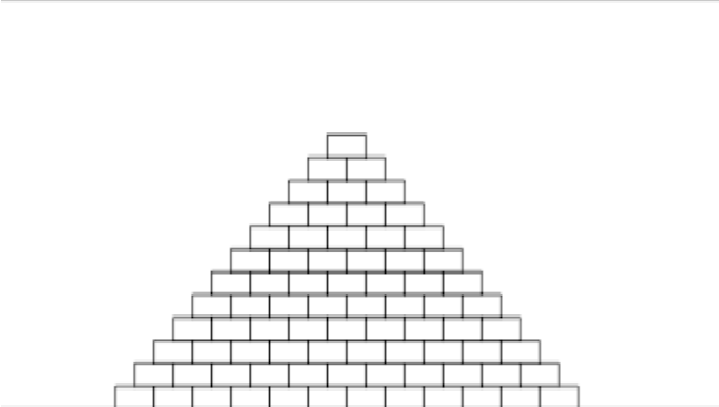
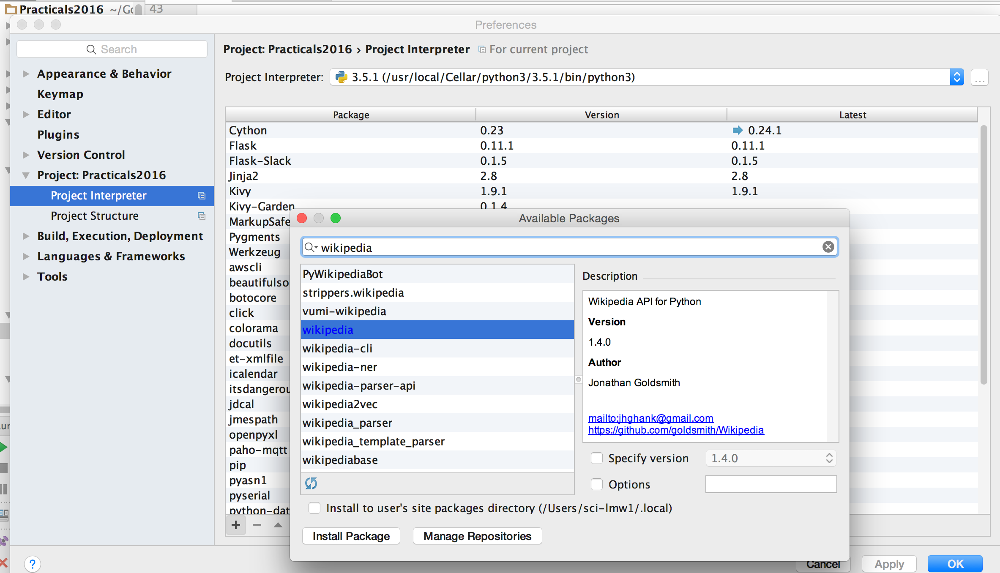
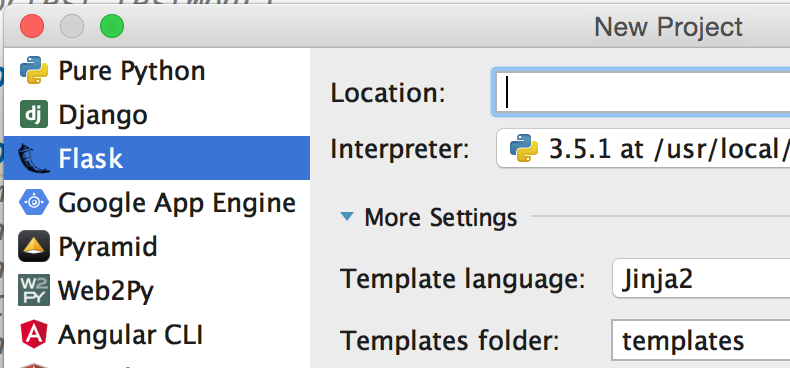
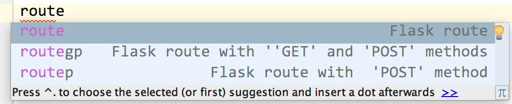
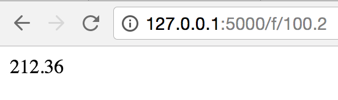

# Practical 10 - Recursion, Testing, API, Flask

Today we will explore the use of **recursion**, tools for **testing**,
an **API** for Wikipedia and the very cool **Flask** Web framework. This
is the final marked practical for the subject, and must be
satisfactorily attempted during the prac time (no marking next week).
You don't have to finish it but you have to do good work.

Start by downloading the prac files from this folder.  
These files have `# TODO` comments to show you what steps to do.

# Recursion


Open recursion.py and read the code, then **write down** (on paper, like
it's a practice exam question!) the expected output for the first
function, `do_it(5)` **BEFORE** you run it.

Then run it to see if you were right.

Then use the **debugger** to step through the execution to see what's
happening.

Do the same for the next function - start by uncommenting 
`# do_something(4)`

You'll find a problem... The function should print the squares of
positive numbers from n down to 0, but instead it runs until the maximum
recursion limit is reached...  
**Fix this.**

**Challenge for later:** Write another version of this that recursively
prints the squares backwards (i.e. on the way back after hitting the
base case).

### Recursion From Scratch

Do this next exercise in the same file, recursion.py.

  

Consider that you want to try for the
world 2D pyramid block building record.  
Write a program to get the number of rows from the user and calculate
the number of blocks you will need given the number of rows (n) to make
a 2D pyramid.  
**Do this first as a simple loop in a function**, then **write a
recursive function** to calculate the number of blocks. As always, think
about good function design. It should **take in** the number of rows and
**return** the number of blocks.

The number of blocks for n rows is:

`n + (n-1) + (n-2) + ... 2 + 1`

E.g. for 6 rows, it is 6 + 5 + 4 + 3 + 2 + 1 = 21

# Testing

Follow the TODO instructions in testing.py, taking note that the code
shows you examples to learn form.

1.  Fix the `repeat_string` function so that it passes the `assert` test. 
 
    Note: Don't change the test!  
    The failing test shows that the function is broken; fix the function.

2.  Write at least two `assert` statements to show if Car sets the fuel
    correctly.

3.  Uncomment the `doctest.runmod()` line to see how the doctests run.

    Note: PyCharm might detect your tests and automatically run your
    program in doctest mode.

4.  Fix the failing `is_long_word` function

5.  Write and test (using doctest) a function to format a phrase as a
    sentence - starting with a capital and ending with a single full
    stop. See the comments for how to do this step by step, taking note
    that you should write your tests _before_ your code.  
    E.g. the function should change "hello" into "Hello."

# Wikipedia API & Python Library

Until now, we've only worked on our local computers, interacting with
local files, but never talking to the great big computer in the sky...
so let's do that now :)

Many systems have public **APIs** (Application Programmer Interfaces) that
we can use. An API is a set of functions that we can call to send and
receive data to and from a system. You can write code to interact with
things like Twitter, Flickr, weather services, government databases, NSA
spy satellites and more...

We'll start with Wikipedia.

Instead of writing our own HTTP calls to the Wikipedia API, we can make
use of a Python library that abstracts the details away and presents a
simpler, Python-based, API for us. *We need to install that now*.

The lab PCs should let us install packages. If it looks like the package
is still installing (infinitely), just carry on as if it were finished
and it should work... or just restart PyCharm if you'd like it to stop
telling you it's installing! If you really can't install the wikipedia
package, then skip those parts of the prac that use it.

In PyCharm, go to Settings/Preferences > Project: Practicals > Project
Interpreter (it might look a bit different but you should have been here
before) and click the plus button to install a package. Type "wikipedia"
to find the one we want, and then click "Install Package".



The quick start documentation for the wikipedia package can be found at:
<https://wikipedia.readthedocs.io/en/latest/quickstart.html>

As this documentation shows, a good way to learn a new package like this
is via the console. Open the console in PyCharm, then follow the docs and 
quickly try out functions like `search()`, `summary()` and `page()`.  
Get a page and see what properties it has.

**Create a new file** called **wiki.py** and write a small script that
prompts the user for a page title or search phrase, then prints the
summary of that page. Use a simple loop that continues doing this until
the user enters blank input.

Try this with a few page titles and see what happens.  
(Note that you might get a warning about an outdated use of the
BeautifulSoup package. We can't fix that so ignore it.)

Try it with the search/title "Monty" and you should find that the
Wikipedia API returns a "disambiguation" page, so you need to handle
that **exception** as explained in the API's docs.

Now **modify** your program so when it gets the page, it prints the
title, summary and the URL.

# Flask Web Framework

Until now, we have made only one type of project, "Pure Python", and we
always interacted via PyCharm with the console - or using a GUI we made
with Kivy. A very common way to deliver software these days is via a Web
browser. Some programming languages are designed for the Web - like
JavaScript for the browser and PHP for Web servers, but we can also use
Python... if we use it via a "Web Framework".

There are a number of great frameworks, like Django, Web2Py and Pyramid,
but today we will use **Flask**.  
(You may be interested to know that [WakaTime](https://wakatime.com) 
is written in Python and uses Flask.)

Flask docs are at: <http://flask.pocoo.org/docs> and Flask is also
covered in the textbook in **Appendix E**.

In PyCharm, create a new project and choose Flask. (Note that you need
the Professional edition, not the Community edition to see this screen
when making a new project.) If this is the first time you've done this,
PyCharm should install the Flask package and other dependencies like
Jinja for templating.



The default project comes with a folder structure and a simple "hello
world" example:

```python
from flask import Flask

app = Flask(__name__)


@app.route('/')
def hello_world():
    return 'Hello World!'


if __name__ == '__main__':
    app.run()

```

## Explanation
After importing the flask class, we create an instance of the Flask class called `app`, passing the name of this file                

`@` is used for what's called a **"decorator"**.                              
This is metadata about the following function.  
In Flask, the `@app.route` decorator specifies the URL that will result in the function following it being called.        

Then we have a normal function (`hello_world()`), but importantly it returns a string.                          
All Flask "views" (functions that will be displayed in the browser) must return strings.
                                  
Running a Flask app (`app.run()`) looks similar to Kivy, doesn't it?

Run the code and you should see output like the following, including a
link to click on to see your amazing new Python-based website. Click the
link in the Python console to view "Hello World!" in your browser.

`* Running on http://127.0.0.1:5000/ (Press CTRL+C to quit)`

Modify the function output to return `<h1>Hello World :)</h1>` and
rerun the program by pressing Ctrl+F5.  
To see the new results, you'll need to go back to your browser and hit
refresh, so do this now.

As you should see, pages/views are created using HTML. Learning HTML is
beyond the scope of this prac, so hopefully you already know some.

Make another view function by using the 'route' shortcut... that is,
type 'route' and wait for the popup, then choose the first option by
pressing Enter... and PyCharm will create the decorator and function
definition stubs.



Type 'greet' as the function name and route name (these can be
different, but we'll keep them the same). Replace 'pass' with a simple
`return "Hello"` statement.

Re-run the program, then change your browser's URL by adding /greet to
the end, like:

<http://127.0.0.1:5000/greet>

This is a bit simple so far... but we're getting there...

Note: If you ever get an "Internal Server Error" in the browser... this
is *your* server (Python program)!  
Go back to PyCharm and look for error messages in the console.

Add another decorator so that the greet function runs for multiple "sub"
routes and takes a parameter, like:

```python
@app.route('/greet')  
@app.route('/greet/<name>') 
def greet(name=""):
    return "Hello {}".format(name)
```

Re-run and test with the URLs <http://127.0.0.1:5000/greet> and
<http://127.0.0.1:5000/greet/Yourname>

This is one way that you can pass parameters (all strings) to Flask view
functions.

## Challenge

In an earlier prac, you wrote a function to convert between Fahrenheit
and Celsius. Copy or rewrite this function as a regular function (not a
route). It should take a Celsius float value and return a Fahrenheit
float.

Now, create a new route so that you can enter Celsius values in the URL
and see the Fahrenheit values in the Web page, like below. Note that the
parameter passed via the URL (100.2 in this case) is a string.



That's version 1... Once it works, modify it so the output shows the
input value and the result with useful text.

## Flask + Wikipedia API

Now let's combine the Wikipedia API with our new-found Web programming
powers...

Clone or download the demo from
<https://github.com/lindsaymarkward/flaskdemo>

Run it and test it, then study the code to find a few new things:

-   This demo uses **Jinja** HTML templates, which makes formatting Web page
    outputs much nicer than hard-coding them in Python.

-   It also uses "template inheritance", so that you can reuse parts of
    templates in other templates. That's how the navigation and footer
    persist.

-   The search route has an HTML form in it. When it's submitted, it
    sends the data via the HTTP "post" method, so the route has to be
    customised to accept this. It then gets the data from the "request"
    object.

-   `url_for()` is a function that returns the correct URL for a given
    view/route function so you don't have to know the exact path.

### Modifications

Right, so now it's your turn to make this more interesting and
appealing. What else could you do to it?

-   Start by adding the page title to the results

-   Then add some details to the **about** page using a new template

-   Then add a link to the about page in your layout template

-   Then go crazy... :)

Before you go... have you completed the **YourJCU subject survey** for
this and your other subjects?  
If not, please do that right now on LearnJCU.  
***Thank you... your input is extremely valuable!***

# Practice & Extension Work

1.  Write a program that prints a string from the outside in, **using
    recursion**.  
    E.g. if the string to print is "Programming", your program should
    print: "P g r n o i g m r m a".  
    Another example:  
    
        Enter a string: 123456  
        1 6 2 5 3 4  
        
    Remember to analyse and design this problem first. Think about the
    base and recursive cases - when will it stop (base) and how will it
    reduce the problem (recursive) each time?

2.  Write a recursive function to check whether or not a string is
    a palindrome.  
    A palindrome is a word or phrase that reads the same forwards as
    backwards. The following are examples:

    -   Hannah
    
    -   abcba
    
    -   (ignoring case, spaces and punctuation) A Toyota's a Toyota

3.  Add **`assert`** and **`doctest`** testing to your work from an earlier
    prac - e.g. the `is_valid_password()` function from prac 2 and the
    `get_fixed_filename()` function from prac 9.

4.  During the holidays you might like to experiment with Flask and see
    if you can make some cool Web interfaces for your existing
    programs...

    A **great idea** would be to make programs with 3 interfaces: console,
    Kivy and Web, and reuse as much common code as you can. That should
    help you see how modular your work is. This would help you
    understand the **MVC** (Model-View-Controller) pattern more, as you just
    want to create 3 different views that use the same model.
